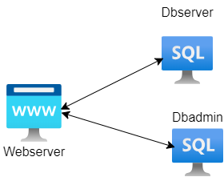

<p align="center"> 
  <h1 align="center"> Deploying via Vagrant </h1> 
  <h5 align="center">August 2024 - Bernice Kagemulo</h5> 
  
  <p align="center"> 
    Using virtualisation to effect portable building and deployment of software applications 
  </p> 
</p>

---

# Overview

The Bernice's Electronics online shopping system is an e-commerce platform designed to provide customers with an easy and convenient way to purchase electronic devices. The system includes key functionalities such as customer account management, user authentication, and product browsing creating a robust user-friendly application. 

Behind the scenes, the system is distributed across three virtual machines (VMs) for enhanced performance and scalability. This was done with the use of Vagrant. Thus enabling easy scaling of both web and database services, ensuring the platform remains responsive under varying loads.

## File Tree

-  `build-vms-scripts` -Contains the scripts to build the virtual machines needed
-  `www` - Contains the PHP webpages  
-  `database` - Contains the sql files needed to set up the Bernice Electronics database 

---

## Running the Project 
Running the application requires Vagrant and VirtualBox (Oracle VM) to be installed on your machine.


1. Clone the Repository using the following command:
```sh
git clone https://github.com/Beleifte/COSC349-VagrantVirtualisation.git
```

2. Change into the project directory:
```sh
cd COSC349-VagrantVirtualisation
```

3. Build and run the application:
```sh
vagrant up

```

4. Interact with the application using the following URLs:
- Homepage : [`http://127.0.0.1:8080`](http://127.0.0.1:8080)
- Create an Account: [`http://127.0.0.1:8080/add-customer.php`](http://127.0.0.1:8081/add-customer.php)
- Browse Products [`http://127.0.0.1:8080/view-products.php`](http://127.0.0.1:8080/view-products.php)
- Sign in: [`http://127.0.0.1:8080/customer-sign-in.php`](http://127.0.0.1:8081/customer-sign-in.php)


5. Shut down the application:
```sh
vagrant destroy 
```

* * * * *

## Application Structure
This project is built utilising three virtual machines. The virtual machines are as follows:

- **Database Server:** Manages the whole MySql database system.
- **Database Admin:**  Manages the Bernice's Electronics database.
- **Webserver:**  Host the application's webpages.Serves web pages and forms where users can submit their input. 

The separation between the VMS offers several advantages. It ensures a clear separation of responsibilities, enhancing security by isolating different functions and minimizing the impact of potential breaches. This architecture also improves scalability and performance, as each VM can be optimized and scaled independently based on its specific role.

They interact through the webpages sending queries to the database servers according to the privileges they have and the result required.



---

## Example Data 
The application comes preloaded with example data that includes 5 customers and a few products to demonstrate its functionality. The customers are used to test the user authentication properties of the platform.

The customers are as follows:


| First Name | Surname| Username | Shipping Address| Email Address | Password |
|---------|---------------|----------|----------|----------|----------|
| John | Doe | john_doe | 123 Elm Street, Springfield, IL, 62704 | john.doe@example.com | password123 |
| Jane | Smith | jane_smith | 456 Oak Avenue, Rivertown, TX, 75001| jane.smith@example.com | securepass456 |
| Alice | Jones | alice_jones | 789 Maple Road, Willow Creek, CA, 94001 | alice.jones@example.com | alicepass789 |
| Bob | Brown | bob_brown | 101 Pine Lane, Lakeside, FL, 33101| bob.brown@example.com | bobpass101 |
| Carol | White | carol_white | 202 Cedar Street, Mountain View, CO, 80301 | carol.white@example.com| carolpass202 |

---

     
## Further Development      
The e-commerce platform is a flexible and versatile application that can be moulded to suit any enterprise's needs.
Some examples include: 

### Shopping Cart and Checkout
Implement shopping cart functionality to allow customers to add items, review purchases, and complete checkout.
This can be done by adding additional PHP webpages to handle the new customer requests.

### Product Database Integration
Add backend integration for managing product inventory, customer orders, and real-time stock updates. This can be done by changing the way the database is set up. Making the database relational with more than 2 tables. To get the result have a table that connects Customer and Product using a foreign key.


This project provides a solid skeleton foundation for an e-commerce platform, with clear growth opportunities.


